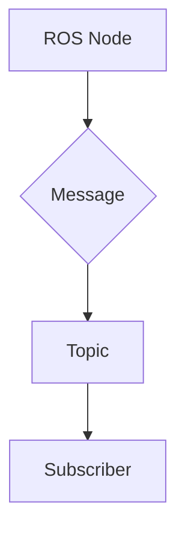

# Quickstart: Physical AI & Humanoid Robotics Course Book

## Prerequisites
- Node.js 18 or higher
- npm or yarn package manager
- Git for version control
- GitHub account for deployment

## Setup Instructions

### 1. Clone and Initialize
```bash
# Clone the repository
git clone <repository-url>
cd <repository-name>

# Navigate to the website directory
cd website

# Install dependencies
npm install
# or
yarn install
```

### 2. Start Development Server
```bash
# Start the development server
npm run start
# or
yarn start
```
This will start the Docusaurus development server at `http://localhost:3000` with hot reloading.

### 3. Project Structure Overview
```
website/
├── docs/                 # Course content (organized by modules)
│   ├── intro.md         # Homepage content
│   ├── module-1/        # Module 1: ROS 2 content
│   ├── module-2/        # Module 2: Gazebo & Unity
│   ├── module-3/        # Module 3: NVIDIA Isaac
│   └── module-4/        # Module 4: Vision-Language-Action
├── src/
│   ├── components/      # Custom React components
│   ├── css/             # Custom styles
│   └── pages/           # Additional pages
├── static/              # Static assets (images, files)
├── docusaurus.config.js # Site configuration
└── sidebars.js          # Navigation configuration
```

### 4. Adding Course Content
To add a new lesson to a module:

1. Create a new MDX file in the appropriate module folder:
   ```bash
   # Example: Adding a new lesson to Module 1
   touch docs/module-1/new-lesson.mdx
   ```

2. Add frontmatter to your MDX file:
   ```md
   ---
   title: Your Lesson Title
   description: Brief description of the lesson
   sidebar_position: 3  # Position in sidebar
   ---

   # Your Lesson Title

   Your lesson content here...
   ```

3. Update `sidebars.js` to include your new lesson in the navigation:
   ```js
   // In sidebars.js
   module.exports = {
     tutorialSidebar: [
       {
         type: 'category',
         label: 'Module 1: ROS 2',
         items: [
           'module-1/index',
           'module-1/your-new-lesson',  // Add this line
         ],
       },
     ],
   };
   ```

### 5. Using Custom Components
The site includes custom components for educational content:

**Interactive Quiz:**
```md
import Quiz from '@site/src/components/Quiz';

<Quiz
  question="What is ROS 2?"
  options={["Robot Operating System", "Robotics Open Source", "Robot Operating System 2", "Really Old System"]}
  correctAnswer={2}
  explanation="ROS 2 is the second generation of the Robot Operating System."
/>
```

**Code Examples with Tabs:**
```md
import Tabs from '@theme/Tabs';
import TabItem from '@theme/TabItem';

<Tabs>
<TabItem value="python" label="Python">
```python
import rclpy
from rclpy.node import Node
```
</TabItem>
<TabItem value="cpp" label="C++">
```cpp
#include <rclcpp/rclcpp.hpp>
```
</TabItem>
</Tabs>
```

### 6. Diagrams and Visual Content
Use Mermaid diagrams directly in MDX files:
```md

```

Or embed SVG diagrams in the `static/img/` folder and reference them:
```md

```

### 7. Build for Production
```bash
# Build the static site
npm run build
# or
yarn build
```
The built site will be in the `build/` directory and ready for deployment.

### 8. Local Testing
```bash
# Serve the built site locally for testing
npm run serve
# or
yarn serve
```

## Development Workflow
1. Create a new branch for your content changes
2. Add or modify MDX files in the appropriate module folders
3. Update sidebars.js if adding new content to navigation
4. Test changes using `npm run start`
5. Commit changes with descriptive commit messages
6. Push to GitHub and create a pull request

## Common Tasks

**Add a new module:**
1. Create a new folder in `docs/` (e.g., `docs/module-5/`)
2. Add an `index.md` file as the module homepage
3. Update `sidebars.js` to include the new module
4. Add the module to the main navigation

**Update site configuration:**
- Edit `docusaurus.config.js` for site metadata, theme settings, and plugin configurations
- Edit `sidebars.js` for navigation structure
- Edit `src/css/custom.css` for custom styling

**Deploy to GitHub Pages:**
The site automatically deploys when changes are pushed to the main branch via GitHub Actions.